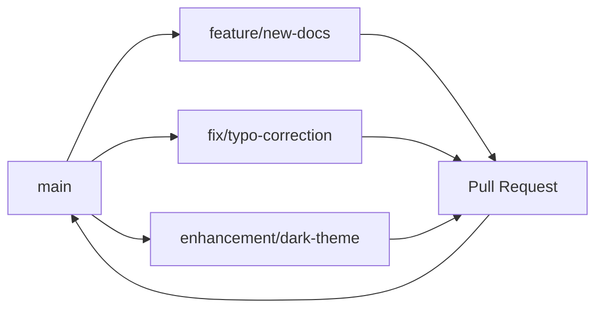

# Development Guide

Learn how to contribute to this project and develop documentation effectively.

## Getting Started with Development

### Development Environment Setup

1. **Fork the Repository**
   ```bash
   # Fork on GitHub, then clone your fork
   git clone https://github.com/YOUR_USERNAME/RevoltDocs.git
   cd RevoltDocs
   ```

2. **Set Up Development Environment**
   ```bash
   python -m venv .venv
   source .venv/bin/activate  # Linux/macOS
   # or .venv\Scripts\activate on Windows
   
   pip install -r requirements.txt
   ```

3. **Start Development Server**
   ```bash
   mkdocs serve --dev-addr=127.0.0.1:8000
   ```

## Contribution Guidelines

### Code of Conduct

We are committed to providing a welcoming and inclusive experience for everyone. Please:

- Be respectful and considerate
- Focus on constructive feedback
- Help others learn and grow
- Report any unacceptable behavior

### How to Contribute

=== "Documentation"

    **Improving Content**
    - Fix typos and grammar errors
    - Add missing information
    - Improve clarity and readability
    - Add examples and code snippets

    **Adding New Pages**
    1. Create new `.md` file in `docs/`
    2. Add to navigation in `mkdocs.yml`
    3. Follow existing style and structure
    4. Test locally before submitting

=== "Code"

    **MkDocs Configuration**
    - Theme customization
    - Plugin integration
    - Navigation improvements
    - Search optimization

    **Custom Styling**
    - CSS customizations
    - Theme overrides
    - Responsive design improvements

=== "Bug Reports"

    **When Reporting Issues**
    - Use the issue template
    - Include steps to reproduce
    - Provide system information
    - Add screenshots if helpful

    **Before Submitting**
    - Search existing issues
    - Check if it's already fixed
    - Try to reproduce on different browsers

## Development Workflow

### Branch Strategy



### Pull Request Process

1. **Create Feature Branch**
   ```bash
   git checkout -b feature/your-feature-name
   ```

2. **Make Changes**
   - Write clear, concise commits
   - Follow existing code style
   - Test your changes locally

3. **Submit Pull Request**
   - Use descriptive title
   - Explain what and why
   - Link related issues
   - Request review

### Quality Standards

!!! success "✅ Good Practices"
    - Clear, descriptive commit messages
    - Test changes locally before pushing
    - Follow markdown style guide
    - Keep changes focused and atomic
    - Update relevant documentation

!!! danger "❌ Avoid These"
    - Large, unfocused commits
    - Breaking existing functionality
    - Ignoring linting errors
    - Missing documentation updates
    - Direct pushes to main branch

## Technical Details

### Project Structure

```
RevoltDocs/
├── docs/                 # Documentation source files
│   ├── index.md         # Homepage
│   ├── setup.md         # Setup guide
│   ├── achievements.md  # Achievement system
│   ├── faq.md          # FAQ page
│   └── development.md   # This page
├── mkdocs.yml          # MkDocs configuration
├── requirements.txt    # Python dependencies
└── .github/            # GitHub workflows
```

### Configuration Options

The `mkdocs.yml` file contains several important sections:

- **Theme**: Material theme with dark/light mode
- **Navigation**: Tab structure and page organization
- **Extensions**: Markdown extensions for enhanced features
- **Plugins**: Additional functionality

### Custom Styling

To add custom CSS:

1. Create `docs/stylesheets/extra.css`
2. Add to `mkdocs.yml`:
   ```yaml
   extra_css:
     - stylesheets/extra.css
   ```

## Advanced Features

### Markdown Extensions

This site uses several powerful extensions:

- **PyMdown Extensions**: Enhanced markdown features
- **Admonitions**: Info boxes and callouts  
- **Tabbed Content**: Organize content in tabs
- **Code Highlighting**: Syntax highlighting for code blocks
- **Emoji Support**: Material Design icons and emojis

### Dark Mode Implementation

The dark mode toggle is configured in the theme palette:

```yaml
theme:
  palette:
    - scheme: slate      # Dark mode (default)
      toggle:
        icon: material/brightness-4
        name: Switch to light mode
    - scheme: default    # Light mode
      toggle:
        icon: material/brightness-7
        name: Switch to dark mode
```

## Deployment

### GitHub Pages

Automatic deployment is set up via GitHub Actions:

```bash
# Manual deployment
mkdocs gh-deploy
```

### Local Testing

Always test before deploying:

```bash
# Build site
mkdocs build

# Serve built site
mkdocs serve
```

## Getting Help

### Resources

- [MkDocs Documentation](https://www.mkdocs.org/)
- [Material Theme Docs](https://squidfunk.github.io/mkdocs-material/)
- [Markdown Guide](https://www.markdownguide.org/)
- [Python Markdown Extensions](https://python-markdown.github.io/extensions/)

### Community

- **GitHub Issues**: Report bugs and request features
- **Discussions**: Ask questions and share ideas
- **Pull Requests**: Contribute code and documentation

!!! tip "Ready to Contribute?"
    Start with small improvements like fixing typos or adding examples. Every contribution helps make the documentation better!

---

**Happy coding!** 🚀
